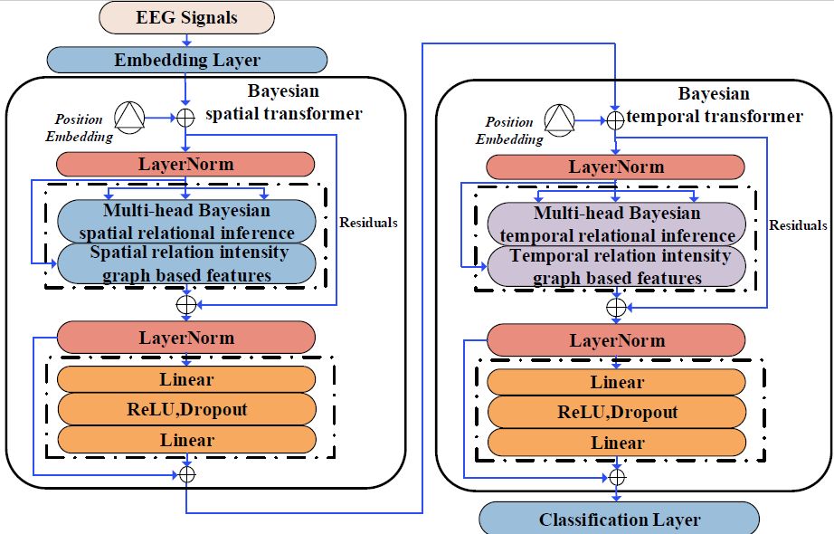

# BSTT
A Bayesian Spatial-Temporal Transformer for Sleep Staging

The files in folder BSTT are the source code and experimental setup for the ISRUC database.

# Datasets

 We evaluate our model on the Montreal Archive of Sleep Studies (MASS)-SS3 dataset and ISRUC dataset. The Montreal Archive of Sleep Studies (MASS) is an open-access and collaborative database of laboratory-based polysomnography (PSG) recordings. Information on how to obtain MASS-SS3 can be found [here](http://massdb.herokuapp.com/en/). Information on how to obtain ISRUC can be found [here](https://sleeptight.isr.uc.pt/).
 
 # Preprocess

 We currently open source the model part of BSTT and users need to process the input data themselves. Specifically, the input data dimensions for the model are (Batch size dimension, spatial feature dimension, temporal feature dimension, feature vector dimension). For the sleep staging task, the output of the model is a five-category result, which can be adapted to other tasks by changing the output of the last layer.
 
 # Reference
 
> @inproceedings{liu2023bstt, 
>   title={BSTT: A Bayesian Spatial-Temporal Transformer for Sleep Staging}, 
>   author={Liu, Yuchen and Jia, Ziyu}, 
>   booktitle={The Eleventh International Conference on Learning Representations}, 
>   year={2023} 
> }

# Environment

- CUDA 10.0
- Pytorch

# Licence

- For academic and non-commercial use only
- Apache License 2.0
